# coursera-ios-swift-5

# Descripción del Proyecto
**Contenido**
- [Pantalla de Inicio](#pantalla-de-inicio)
- [Códigos QR](#c-digos-qr)
  * [Lectura/Escáner](#lectura-esc-ner)
  * [Visualización de Contenido](#visualizaci-n-de-contenido)
- [Rutas](#rutas)
  * [Tabla de Rutas](#tabla-de-rutas)
  * [Permiso de Acceso a la Ubicación](#permiso-de-acceso-a-la-ubicaci-n)
  * [Ubicación Actual](#ubicaci-n-actual)
  * [Agregar un Sitio](#agregar-un-sitio)
  * [Ver Ruta](#ver-ruta)
  * [Compartir Ruta](#compartir-ruta)
  * [Realidad Aumentada](#realidad-aumentada)
  * [Guardar Ruta](#guardar-ruta)
  * [Lectura de Código QR](#lectura-de-c-digo-qr)
- [Eventos](#eventos)
- [Acerca de](#acerca-de)
- [Apple Watch](#apple-watch)

## Pantalla de Inicio
Como lo requiere el proyecto, se tienen las opciones:
- Rutas
- Códigos QR
- Eventos
- Acerca de

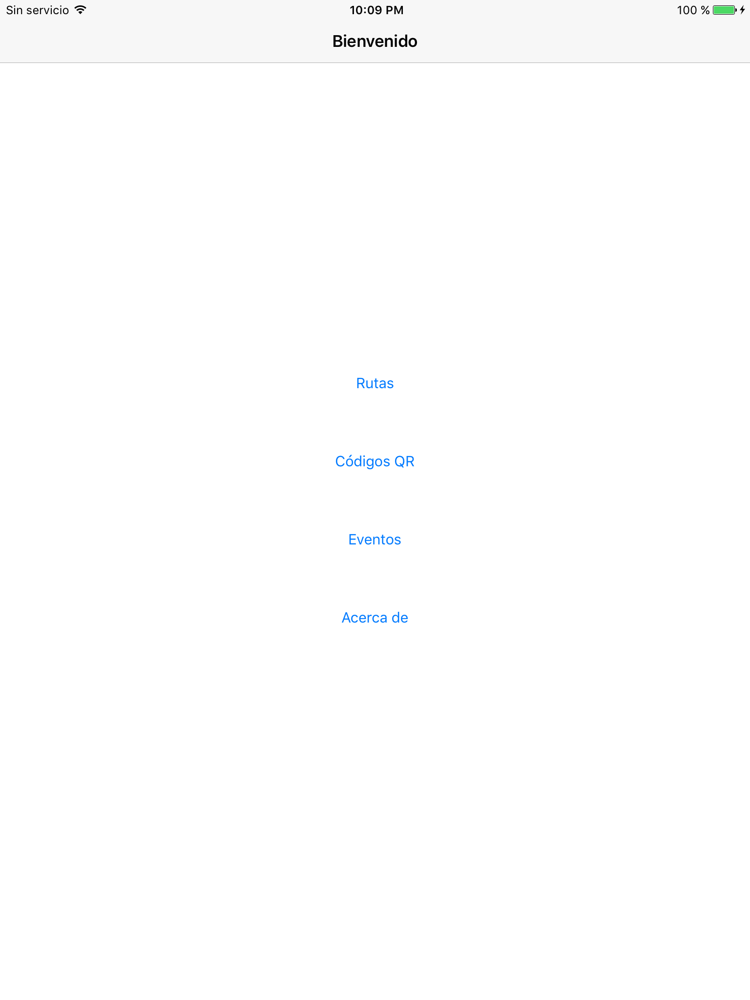
Figura 1 - Pantalla de Inicio

## Códigos QR
### Lectura/Escáner
Aquí se tiene una pantalla que permite escanear un código QR mediante la cámara del dispositivo. Dado que se requiere el uso de la cámara, esta pantalla sólo funciona en un dispositivo iPhone o iPad real, no por Simulador, y necesita aprobación del permiso solicitado por el dispositivo.

Se pueden generar códigos QR de pruebas con URL mediante:
[https://createqrcode.appspot.com](https://createqrcode.appspot.com)

Figura 2 - Escáner de Código QR

### Visualización de Contenido
Al escanear correctamente un código QR de una URL, se muestra una pantalla con la URL encontrada en la parte superior y un WebView mostrando el contenido de la página web. La opción "Atrás" lleva de regreso a la página inicial, no al escáner.

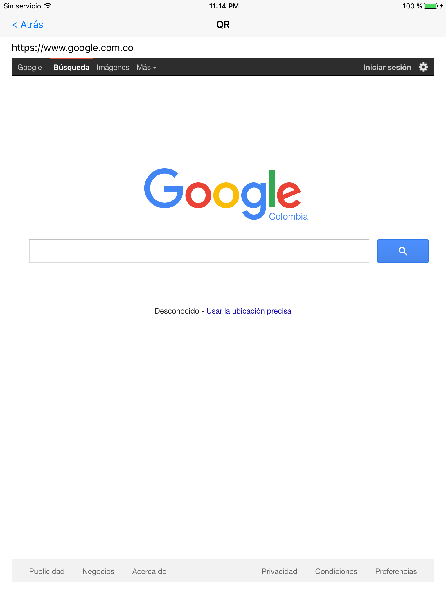
Figura 3 - Contenido de Código QR

## Rutas
### Tabla de Rutas
Inicialmente se muestra una tabla en la cual se muestran las rutas almacenadas en la base de datos local del dispositivo (usando Core Data). La primera vez que se abre la aplicación esta tabla aparece vacía y para empezar a agregar rutas se debe usar el botón de la esquina superior derecha .

Al salir de la aplicación y volver a ingresar se mostrarán las rutas previamente almacenadas.

Figura 4 - Tabla de Rutas

### Permiso de Acceso a la Ubicación
En un principio solicitará permiso en el dispositivo o simulador para acceder a la ubicación actual. __Para proceder con la prueba se debe permitir el acceso solicitado__.

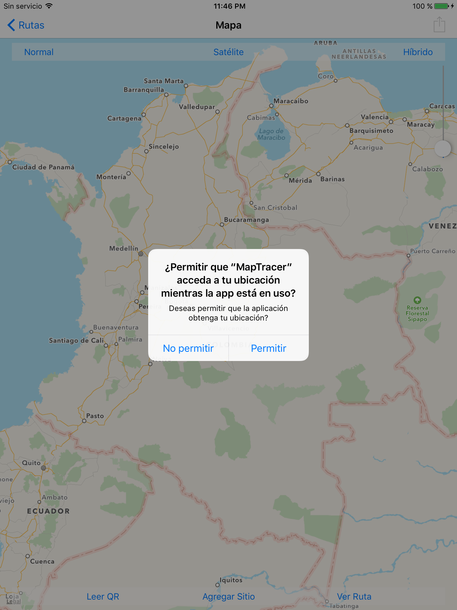
Figura 5 - Solicitud de Permiso para Ubicación

### Ubicación Actual
Una vez se permite acceder a la ubicación actual, se mostrará un mapa indicando el punto en el que se encuentra localizado el dispositivo, o la ubicación emulada en caso de hacer la prueba con el Simulador (opciones "**Debug**" -> "**Location**").

En caso de hacer la prueba con un dispositivo real, dado que el servicio de mapas y generación de rutas de Apple no está disponible en muchas ciudades, el proyecto cuenta con dos archivos GPX con localizaciones predefinidas para permitir una prueba más sencilla de las rutas: **butt-millet_memorial_fountain.gpx** y **freedom_plaza.gpx**

Estas ubicaciones predefinidas se pueden indicar en el dispositivo mediante Xcode, usando las opciones del menú: "**Debug**" -> "**Simulate Location**".

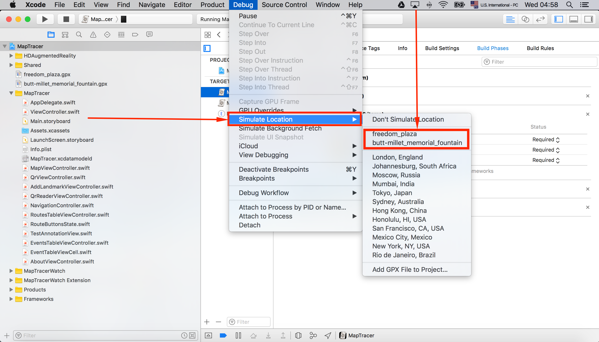
Figura 6 - Selección de Ubicación Predefinida

Al seleccionar por ejemplo "**freedom_plaza**", la aplicación mostrará que la ubicación actual es dicho monumento. Si se quiere, se puede hacer zoom al mapa mediante el gesto por defecto o usando el *slider* ubicado en la esquina superior derecha.

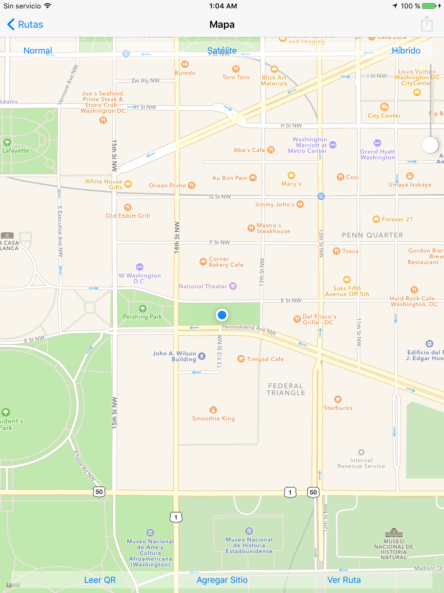
Figura 7 - Ubicación en Freedom Plaza

### Agregar un Sitio
Como se puede ver en la figura 7, en la parte inferior hay una barra con tres botones. El del medio "**Agregar Sitio** permite agregar la ubicación actual como un sitio en la aplicación.

Obligatoriamente debe indicarse un nombre y opcionalmente se puede adicionar una foto, bien sea de la galería o de la cámara. Se debe tener en cuenta que en caso de solicitar permiso del usuario, que se deben aceptar para proceder con la prueba y adicionalmente la cámara sólo funciona en dispositivos reales.

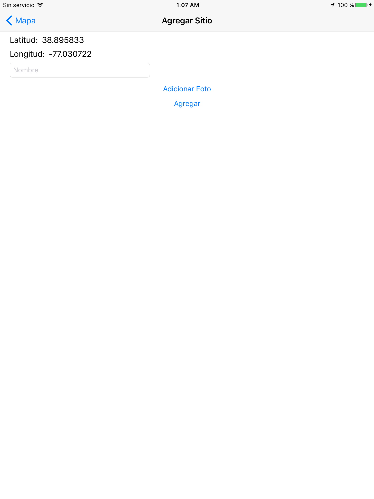
Figura 8 - Agregar un Sitio

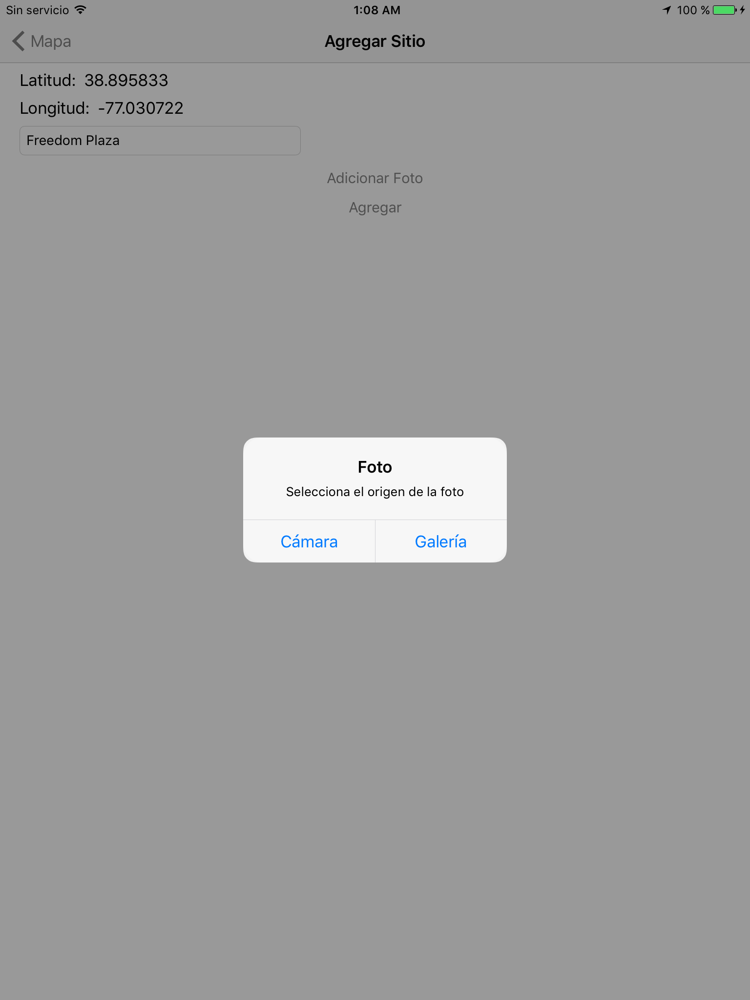
Figura 9 - Selección entre Cámara y Galería

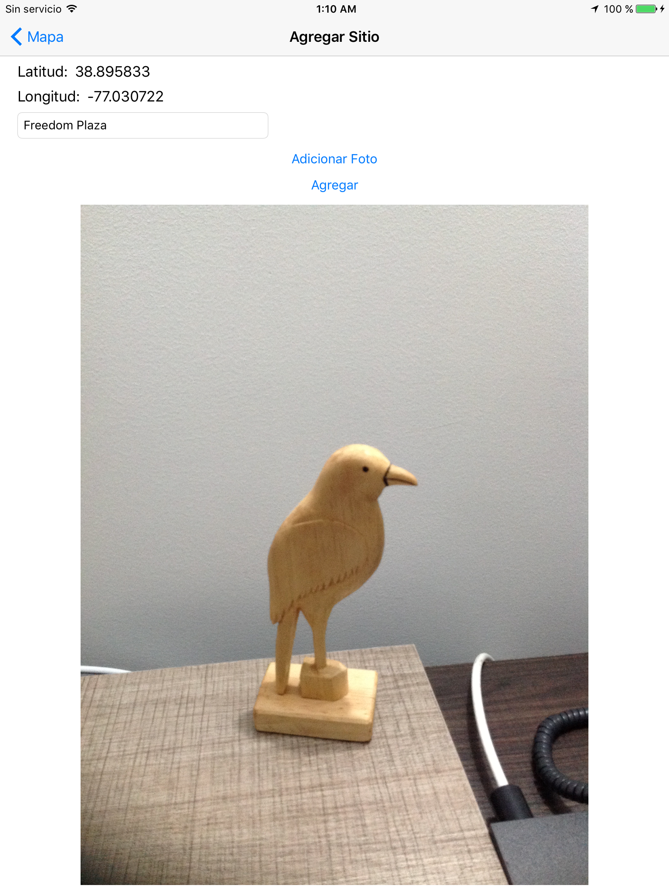
Figura 10 - Agregar Sitio con Foto

Al usar el botón "**Agregar**", el sitio aparecer señalado en el mapa mediante un marcador opin (*Marker*), el cual al hacer tap sobre este mostrará el nombre indicado para el sitio.

Figura 11 - Sitio Agregado

### Ver Ruta
Al mover el dispositivo hasta una nueva ubicación (por ejemplo seleccionando la otra ubicación predefinida "**butt-millet_memorial_fountain**") se puede agregar como nuevo sitio y posteriormente usar el botón "**Ver Ruta**".

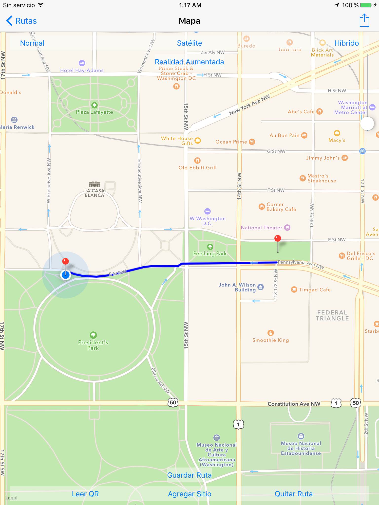
Figura 12 - Ruta entre Sitios

### Compartir Ruta
Mientras se visualiza una ruta aparece habilitado el botón  en la esquina superior derecha, el cual permite compartir la secuencia de nombres de los sitios en la ruta mediante la aplicación que escoja el usuario.

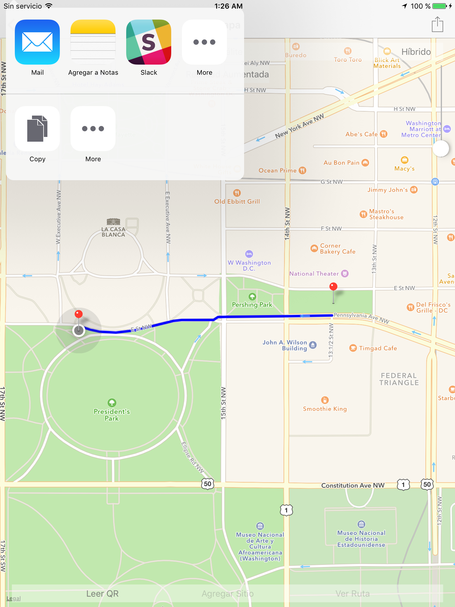
Figura 13 - Escoger Aplicación para Compartir Ruta

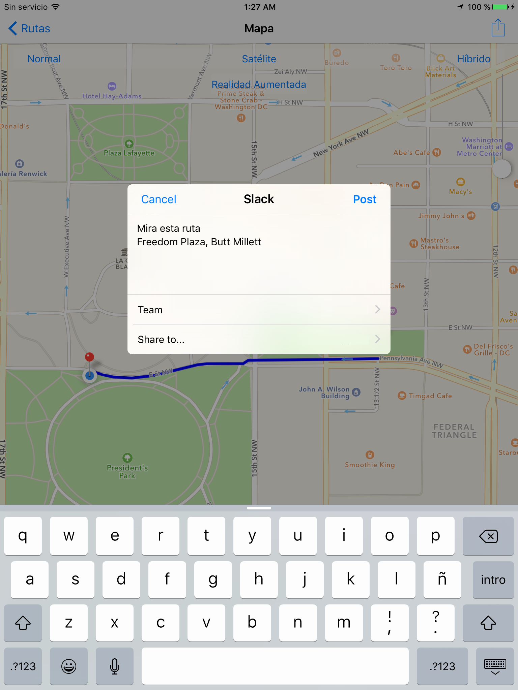
Figura 14 - Compartir Ruta

### Realidad Aumentada
Mientras se visualiza una ruta aparece habilitado el botón "**Realidad Aumentada**" en la parte superior central del mapa, el cual abrirá la vista de la cámara y al apuntar hacia los sitios de la ruta aparecerán anotaciones sobre la imagen con el nombre del punto.

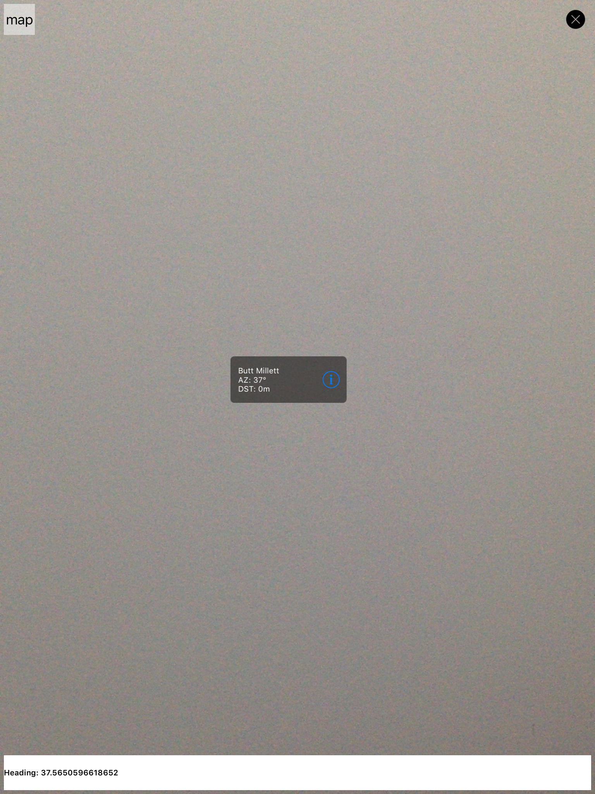
Figura 15 - Sitio en Realidad Aumentada

### Guardar Ruta
Como se ilustra en la figura 12, al mostrar una ruta aparece un nuevo botón en la parte inferior central del mapa llamado "**Guardar Ruta**", el cual permite almacenar la ruta mostrada.

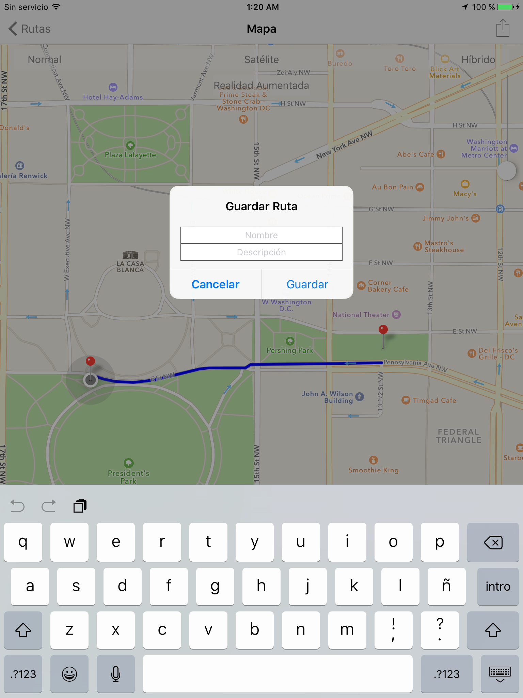
Figura 16 - Guardar Ruta

### Lectura de Código QR
En la parte inferior izquierda del mapa siempre aparece el botón "**Leer QR**", el cual lleva al usuario a la pantalla para escanear un Código QR con una URL (del lugar en que se encuentra) y mostrar el contenido de la página web. En este caso el botón "**Atrás**" lleva al usuario de nuevo a la pantalla de las rutas con el mapa.

## Eventos
Dado que al momento de desarrollar el proyecto no se tenía un archivo JSON proveido en los [materiales del curso](https://www.coursera.org/learn/proyecto-ios-final/discussions/weeks/4/threads/Qn1jAxNZEee-zxLiP2lECg) se usó un archivo propio (con las mismas características indicadas en el enunciado del proyecto en [https://api.myjson.com/bins/g806b](https://api.myjson.com/bins/g806b).

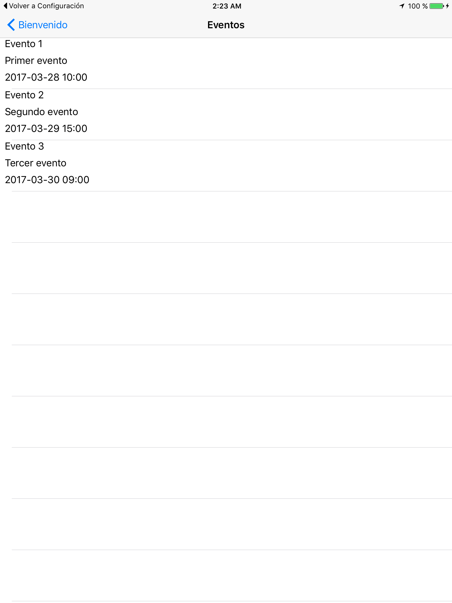
Figura 17 - Eventos

## Acerca de
Muestra la información de la aplicación, como se solicita en la descripción del proyecto.

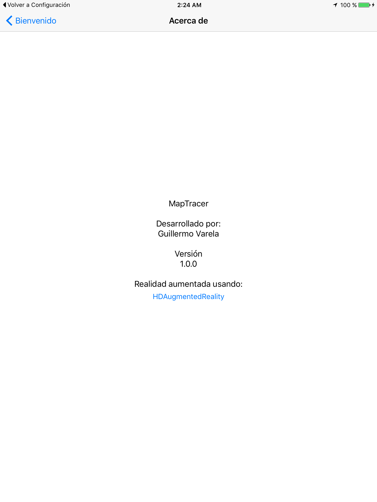
Figura 18 - Acerca de

## Apple Watch
Al ejecutar en conjunto la aplicación en un iPhone y en un Apple Watch, en este último irán apareciendo las rutas a medida que se vayan guardando en el celular.

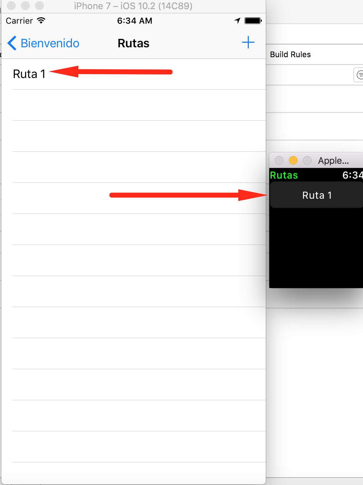
Figura 19 - Tabla de Rutas en Apple Watch

Cuando se selecciona una ruta, se mostrarán hasta un máximo de 5 sitios de la misma (dado que los mapas del Apple Watch no permiten mostrar más de 5 pines/*markers*).

También debido a restricciones del Apple Watch, para ver más información acerca de cada sitio, se debe hacer tap sobre el pin lo cual abrirá la aplicación nativa de mapas (como se vio en los videos del curso). Igualmente se debe recordar que para ver el mapa dentro de la aplicación esta se debe ejecutar en un dispositivo físico debido a las limitaciones del simulador.

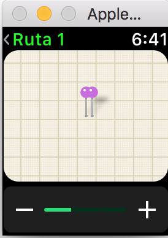
Figura 20 - Sitios en la ruta en Apple Watch